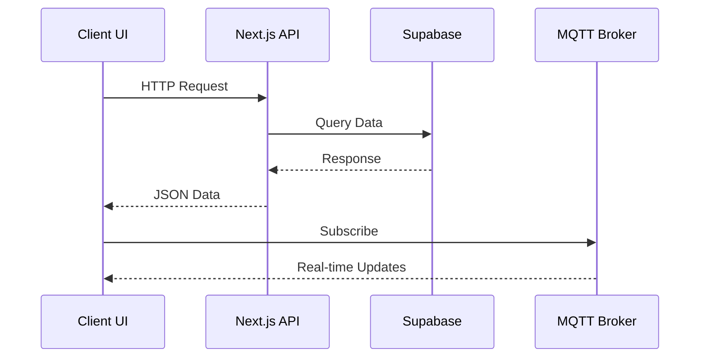

# Smart Home

Modern web interface for IoT device management and home automation.

## 🌟 Features

- Real-time device status monitoring (lights, sensors, cameras)
- Energy consumption analytics with historical data
- Security alerts and notifications system
- Cross-device automation rules
- Responsive dashboard with multi-panel layout
- Secure user authentication and device authorization

## 🛠 Tech Stack

**Core Framework**  
Next.js 15 + React 19 + TypeScript

**UI Components**

- Tailwind CSS 3 + ShadCN/UI
- Recharts for data visualization

**Data Layer**

- Supabase PostgreSQL + Drizzle ORM
- MQTT for real-time device communication
- React Hook Form + Zod for forms

**Services**

- Clerk.js for authentication
- Resend for email notifications
- Vercel Serverless Functions

## 🚀 Getting Started

1. Clone repository:

```bash
git clone https://github.com/tonglam/smart_home-website
cd smart_home-website
```

2. Install dependencies:

```bash
npm install
```

3. Create `.env` file from `.env.example`

4. Start development server:

```bash
npm run dev
```

## 🏗 Architecture

### Core Components

| Component    | Responsibility      | Interfaces With  |
| ------------ | ------------------- | ---------------- |
| Dashboard    | Main interface      | Device API, Auth |
| Device API   | Device management   | Supabase, MQTT   |
| Auth System  | User management     | Clerk.js, DB     |
| MQTT Service | Real-time messaging | IoT Devices      |

## 🏠 Application Structure

### Key Pages

| Page      | Path         | Description                                                  |
| --------- | ------------ | ------------------------------------------------------------ |
| Dashboard | `/dashboard` | Main interface with real-time device controls and monitoring |
| Profile   | `/profile`   | User account settings and notification preferences           |
| Sign In   | `/signin`    | Authentication page for existing users                       |
| Sign Up   | `/signup`    | New user registration page                                   |

### Dashboard Tabs

| Tab            | Components                                                            | Key Features                                                                    |
| -------------- | --------------------------------------------------------------------- | ------------------------------------------------------------------------------- |
| **Overview**   | - Lighting Controls<br>- Security Status<br>- Automation Modes        | Real-time device controls<br>Security sensor status<br>Preset automation scenes |
| **Monitoring** | - Live Camera Feed<br>- Active Alerts                                 | Camera stream access<br>Critical alert notifications                            |
| **Analytics**  | - Energy Usage Charts<br>- Device Health Reports<br>- Security Trends | Historical consumption data<br>Device battery/status reports<br>Event logs      |

### Data Flow



## 🔑 Environment Variables

The following environment variables are required for operation:

| Variable           | Service  | Description         | Where to Get                                                               |
| ------------------ | -------- | ------------------- | -------------------------------------------------------------------------- |
| `CLERK_SECRET_KEY` | Clerk.js | Backend auth secret | [Clerk Dashboard](https://dashboard.clerk.com)                             |
| `SUPABASE_URL`     | Supabase | Database endpoint   | [Supabase Settings](https://supabase.com/dashboard/project/_/settings/api) |
| `MQTT_BROKER_URL`  | HiveMQ   | MQTT broker host    | [HiveMQ Cloud](https://www.hivemq.com/cloud/)                              |
| `MQTT_USERNAME`    | HiveMQ   | Broker username     | [HiveMQ Console](https://console.hivemq.cloud/)                            |
| `MQTT_PASSWORD`    | HiveMQ   | Broker password     | [HiveMQ Console](https://console.hivemq.cloud/)                            |

## 📄 License

MIT Licensed - See [LICENSE](https://github.com/tonglam/smart_home-website/blob/main/LICENSE)

[](https://smarthome-three.vercel.app/)
[](https://github.com/tonglam/smart_home-website/issues)

# Smart Home Camera Streamer

This is a Python application that streams camera feed from a Raspberry Pi to a web application using MQTT.

## Setup Instructions

1. Create and activate virtual environment:
```bash
python3 -m venv venv
source venv/bin/activate
```

2. Install dependencies:
```bash
pip install -r requirements.txt
```

3. Create a `.env` file with your MQTT credentials:
```
MQTT_BROKER=c5230fc20196453ba48d5f77d64fe2ec.s1.eu.hivemq.cloud
MQTT_PORT=8883
MQTT_USERNAME=group24
MQTT_PASSWORD=CITS5506IoT
MQTT_TOPIC=camera/stream
```

4. Run the application:
```bash
python camera_stream.py
```

## Configuration

You can adjust the following parameters in `camera_stream.py`:
- `CAMERA_INDEX`: Camera device index (default: 0)
- `FRAME_WIDTH`: Frame width in pixels (default: 640)
- `FRAME_HEIGHT`: Frame height in pixels (default: 480)
- `FRAME_RATE`: Frames per second (default: 10)
- `JPEG_QUALITY`: Image quality (0-100, default: 80)

## Troubleshooting

1. If camera is not detected:
   - Check if camera is properly connected
   - Try different `CAMERA_INDEX` values
   - Run `ls /dev/video*` to list available cameras

2. If MQTT connection fails:
   - Check your internet connection
   - Verify MQTT credentials in `.env` file
   - Ensure HiveMQ broker is accessible

## Logging

The application logs important events and errors to the console. Check the output for any issues.
