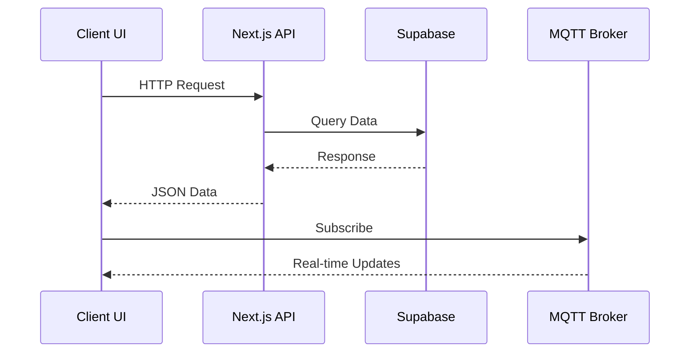

# Smart Home

Modern web interface for IoT device management and home automation.

## 🌟 Features

- Real-time device status monitoring (lights, sensors, cameras)
- Energy consumption analytics with historical data
- Security alerts and notifications system
- Cross-device automation rules
- Responsive dashboard with multi-panel layout
- Secure user authentication and device authorization

## 🛠 Tech Stack

**Core Framework**  
Next.js 15 + React 19 + TypeScript

**UI Components**

- Tailwind CSS 3 + ShadCN/UI
- Recharts for data visualization

**Data Layer**

- Supabase PostgreSQL + Drizzle ORM
- MQTT for real-time device communication
- React Hook Form + Zod for forms

**Services**

- Clerk.js for authentication
- Resend for email notifications
- Vercel Serverless Functions

## 🚀 Getting Started

1. Clone repository:

```bash
git clone https://github.com/tonglam/smart_home-website
cd smart_home-website
```

2. Install dependencies:

```bash
npm install
```

3. Set up environment variables:

Create a `.env` file in the root directory by copying `.env.example`:

```bash
cp .env.example .env
```

Configure the following required environment variables:

**Authentication (Clerk.js)**

- Create a [Clerk.js account](https://clerk.com)
- Create a new application in the Clerk Dashboard
- Navigate to API Keys section
- Copy the `CLERK_SECRET_KEY` and add it to `.env`

**Database (Supabase)**

- Sign up for [Supabase](https://supabase.com)
- Create a new project
- Go to Project Settings → API
- Copy the `Project URL` as `SUPABASE_URL`
- Copy the `anon` public key as `SUPABASE_ANON_KEY`
- Copy the `service_role` secret key as `SUPABASE_SERVICE_ROLE_KEY`

**MQTT Broker (HiveMQ)**

- Create an account on [HiveMQ Cloud](https://www.hivemq.com/cloud/)
- Create a new cluster (free tier available)
- Navigate to Access Management → Credentials
- Set up the following in your `.env`:
  - `MQTT_BROKER_URL`: Your cluster URL (e.g., xxxxx.s2.eu.hivemq.cloud)
  - `MQTT_USERNAME`: Generated username
  - `MQTT_PASSWORD`: Generated password
  - `MQTT_CLIENT_ID`: A unique identifier for your application

**Email Service (Resend)**

- Sign up for [Resend](https://resend.com)
- Create an API key
- Add `RESEND_API_KEY` to your `.env`

Your final `.env` file should look like this (replace with your actual values):

```bash
# Auth
CLERK_SECRET_KEY=sk_test_xxxxxx

# Database
SUPABASE_URL=https://xxxxx.supabase.co
SUPABASE_ANON_KEY=eyJxxxxxx
SUPABASE_SERVICE_ROLE_KEY=eyJxxxxxx

# MQTT
MQTT_BROKER_URL=xxxxx.s2.eu.hivemq.cloud
MQTT_USERNAME=your-username
MQTT_PASSWORD=your-password
MQTT_CLIENT_ID=smart-home-app-dev

# Email
RESEND_API_KEY=re_xxxxxx

# App Config
NEXT_PUBLIC_APP_URL=http://localhost:3000
```

4. Start development server:

```bash
# Kill any existing process on port 3000 if needed
lsof -ti:3000 | xargs kill -9 2>/dev/null || true

# Start the development server
npm run dev
```

The application should now be running at [http://localhost:3000](http://localhost:3000)

## 🏗 Architecture

### Core Components

| Component    | Responsibility      | Interfaces With  |
| ------------ | ------------------- | ---------------- |
| Dashboard    | Main interface      | Device API, Auth |
| Device API   | Device management   | Supabase, MQTT   |
| Auth System  | User management     | Clerk.js, DB     |
| MQTT Service | Real-time messaging | IoT Devices      |

## 🏠 Application Structure

### Key Pages

| Page      | Path         | Description                                                  |
| --------- | ------------ | ------------------------------------------------------------ |
| Dashboard | `/dashboard` | Main interface with real-time device controls and monitoring |
| Profile   | `/profile`   | User account settings and notification preferences           |
| Sign In   | `/signin`    | Authentication page for existing users                       |
| Sign Up   | `/signup`    | New user registration page                                   |

### Dashboard Tabs

| Tab            | Components                                                            | Key Features                                                                    |
| -------------- | --------------------------------------------------------------------- | ------------------------------------------------------------------------------- |
| **Overview**   | - Lighting Controls<br>- Security Status<br>- Automation Modes        | Real-time device controls<br>Security sensor status<br>Preset automation scenes |
| **Monitoring** | - Live Camera Feed<br>- Active Alerts                                 | Camera stream access<br>Critical alert notifications                            |
| **Analytics**  | - Energy Usage Charts<br>- Device Health Reports<br>- Security Trends | Historical consumption data<br>Device battery/status reports<br>Event logs      |

### Data Flow



## 🔑 Environment Variables

The following environment variables are required for operation:

| Variable           | Service  | Description         | Where to Get                                                               |
| ------------------ | -------- | ------------------- | -------------------------------------------------------------------------- |
| `CLERK_SECRET_KEY` | Clerk.js | Backend auth secret | [Clerk Dashboard](https://dashboard.clerk.com)                             |
| `SUPABASE_URL`     | Supabase | Database endpoint   | [Supabase Settings](https://supabase.com/dashboard/project/_/settings/api) |
| `MQTT_BROKER_URL`  | HiveMQ   | MQTT broker host    | [HiveMQ Cloud](https://www.hivemq.com/cloud/)                              |
| `MQTT_USERNAME`    | HiveMQ   | Broker username     | [HiveMQ Console](https://console.hivemq.cloud/)                            |
| `MQTT_PASSWORD`    | HiveMQ   | Broker password     | [HiveMQ Console](https://console.hivemq.cloud/)                            |

## 📄 License

MIT Licensed - See [LICENSE](https://github.com/tonglam/smart_home-website/blob/main/LICENSE)

[](https://smarthome-three.vercel.app/)
[](https://github.com/tonglam/smart_home-website/issues)
